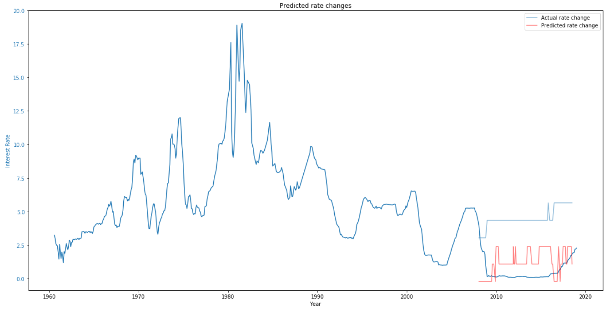

**Technical Document - US FOMC Communication Interest Rate Forecaster**

Shawn D. Mitchell

Executive Summary

Using US Federal Reserve Open Market Committee public communications, we can forecast with approximately 65% accuracy the following 6-month interest rate sentiment.  This is based on using FOMC communications since 1960, and allowing the model to be trained on a random 75% training sample.  Removing portions of data based on date significantly reduces future model accuracy, as the features of the communications changes over time, and the economic/political environment changes over time.  When used with caution, an NLP model using FOMC communications as features can be a useful supplemental tool for interest rate forecasting.

Part 1: Summary and Problem Statement

Can predictions of future interest rates be made based solely on FOMC communications?

Predicting the future actions of the US Federal Reserve is a difficult task, with no method of having 100% accuracy unless one both has internal information at the FOMC and has a perfect view of the future US economic situation.  Their communicated intended actions aren&#39;t always completely aligned with the actions they take, and their real actions could be completely contrary to past communicated intentions following an economic shock.  As with all quantitative machine learning models for finance, it only knows what&#39;s happened in the past.  Economic environments change significantly over time, and every economic shock that occurs has unique characteristics.

An NLP model with reasonable accuracy, combined with additional quantitative and qualitative information, would be a highly valuable tool.  The model should not be relied on as a stand-alone tool.

Part 2: Data

Two sources of data were required for the project: historical interest rates, and the FOMC communication documents.

The FOMC provides download links for all public communications, ranging back to the 1930&#39;s.  The types of communication documents have varied over the years, both the naming of the documents and the scope of the information contained.  Communications are not released every month, and different months may have different types of communications released.  Documents ranged from research articles to press releases and meeting minutes.

To obtain the data, a web scraper function was developed to loop through all requested years and download all documents available for them.  Since the types of communications varied through the years, a single type of document wasn&#39;t used (such as the currently running Beige Book).  Some documents released are of very little analysis value, only containing a brief press statement or announcement that information will be released later.

There were three options for deciding what documents to use:

1. Manual process of scripting specific documents types to use for all months
2. Use all documents
3. Use a consistent pattern to pull a sub-selection for each month

A manual process would be wastefully time consuming, and require frequent updates to specify what documents to use in the future.  Using all the documents would be computationally inefficient, particularly given the fact that many communications PDF&#39;s holds no predictive value.  There may also be a problem with unbalanced data features, if some months have much less information that other months.

A consistent pattern was settled on, using the PDF document for each month that has the largest file size.  There are problems with this approach:

1. Largest file may not have the most text, some files may be image-heavy
2. Largest file may be a section from a multi-part communication document intended to be read as a single whole
3. What the largest file is can vary month to month.  Sometimes it may be a summary of current economic conditions, other months it may be a transcript of FOMC meeting minutes.

Despite these problems, this approach was deemed the best option of the three available.  A balance between computation time and manual scripting time was needed.  Given more time, a more sophisticated algorithm could be developed to identify the best documents to use (word count, identify multi-file releases).

After what documents should be used was determined, a function looped through all valid PDF files and extracted the text to a pandas dataframe.  Each document was assigned a date, based on the date timestamp in the files.  Some files had two dates in the filename, which will cause this method some potentially non-ideal PDF assignments to month.  Some documents were written by the FOMC in the month before they were released to the public.  Since they have two dates, they can be considered as being relevant for both months for the purposes of this model.  The loop to assign PDF documents to a specific month may assign the same document to two consecutive months.  This was determined to not be a major detriment to the model, as the document may legitimately apply to both months.  Some month additionally have no documents released for them, the FOMC does not release communications through all months of the year.

The y-target value is the interest rate change 6 months from the communication release month.

Interest rate data was collected from the US Federal Reserve FRED API, the source data was the daily real interest rate, not the target rate.  The real rate was chosen for three reasons:

1. The real rate closely follows the target rate.
2. The real rate is the actual trading rate, not the target rate.  The real rate is more relevant.
3. The target rate data was incomplete on the FRED API.  The real rate data was complete.

Since the communication documents were grouped by month, the interest rates also needed to be grouped by month.  The data collected was daily, so the monthly y-target used is the mean interest rate per month.  There may be a wide spread between the lowest and highest interest rate every month, however the mean was the best option compared to using a min/max/mode.  It would give the &#39;middle ground&#39; representation of the interest rate environment for that month.
Forecasting actual interest rate percentages would be an extremely specific, and highly difficult continuous value to forecast.  The goal for the project was to create an actionable product that creates believable output.  A specific rate percentage would be far more difficult to justify, rather than a hawkish/dovish sentiment prediction.  The rate ranges over time change significantly, an NLP model would likely find correlations that would be very non-ideal due to the time series nature of the interest rates.  For example, to predict the unusually low interest rate environment we&#39;ve been in for the past several years, the model would likely connect features such as the names of individuals at the FOMC or dates to the interest rate prediction.

By using a hawkish/dovish sentiment prediction, we can remove some of the undesirable connections an NLP model is likely to make.  This sentiment analysis allows our highly unusual low interest rate environment to be compared to past high-interest rate environments.

Initially I explored forecasting monthly sentiment (month+1 = increase, month+2 =neutral, etc.).  This however could lead to volatile predictions, and was a level of detail not required for the forecast.

As seen above, the interest rate environments we have been in for the past few decades have been a rising, neutral, or falling environment.  With a broader and less focused y-target, the model could give a mid-term sentiment prediction, rather than a short-term immediate action prediction.

I&#39;ve settled on a 6-month sentiment prediction, rather than a monthly prediction.  This is focused enough to be an actionable prediction, but broad enough to not throw high volatility into the model.  Below is the example actual flow changes of interest rates.  Middle points in the line are neutral, with rising or falling 6-month rates being above or below.

All data points are considered to be independent of each other.  Time series analysis for interest rate prediction isn&#39;t very useful – past interest rates are not a good indicator of future interest rates.  They would only be primarily useful if there was a routine cyclical pattern.  Recessions occur at irregular intervals, and the long-term interest rate environment can experience significant shifts over time.  The past 10 year near-zero interest rate environment has no precedent, for example.  A major goal of the model is to predict sudden shifts, not forecast current trend.

To summarize the data used:

1. Features are extracted from the monthly PDF communication with the largest file size.  Some months do not have any communications.
2. Y-target is the following 6-month interest rate change: 1, 0, -1 for increasing, neutral, or falling.  The threshold for an increase or decrease is 0.25%.  A 6-month change that does not exceed that plus or minus will be considered neutral.

Part 3: Modelling

Preprocessing work included stemming, stop word removal, conversion to lower case.  Standard process in NLP, removed differences between words with identical or very similar meanings.

Vectorizer used was TFIDF.  All communications were expected to have a large common pool of common words, TFIDF vectorizer was used rather than count vectorizer to assist in identifying words and phrases that may have a higher predictive value for the model.  N\_gram range was 2 to 4 inclusive, with the intent of capturing meaningful context of discussion.  &quot;Rates&quot;, compared to &quot;falling rates&quot;, for example.  Only characters that were alphabetical were included.  When including non-alphabetical characters, features such as &quot;000&quot; would be extracted and potentially viewed as meaningful features.

XGBoost was chosen to the be model, based on the strength and computational speed of the model.  XGBoost has a large set of possible parameters, however the only non-default setting used was setting the limit on depth to 4.  XGBoost has a very strong tendency to overfit to training data, the model used for this project resulted in a 100% training accuracy but approximately 65% accuracy on testing data.  A potential improvement for the model could be grid searching parameters, primarily with the intention of decreasing variance (overfit).  The first parameter in XGBoost to reduce overfit is reducing the depth limit, however a further reduction past 4 was not found to significantly reduce overfit.

Feature importance summary:

The feature importance summary shows mostly logical features having the strongest predictive performance.  A potential further improvement would be building on the stop words, adding pronouns or phrases from meeting minutes that were addressing participants.  Further spell checking would assist in removing word fragments that were viewed as important n\_gram features.

Accuracy Review

The model achieves approximately 65% accuracy currently.  A higher accuracy is potentially undesirable, due to the nature of the features used in creating the predictions.  The real future interest rates are not always a function of what the FOMC intends on doing.  The Federal Reserve would only be able to precisely predict their own future actions if they had perfect information on the state of the economy and financial markets in the future.  A model that does achieve a very high accuracy may very likely be finding non-ideal features to predict future rates, such as dates or proper nouns.

Topic Analysis

Using LDA, we can review an estimated grouping of topics that were discussed in communications that preceded reductions or increases in actual interest rates.  Reviewing the topics for the topics that preceded increases:

The discussion topics may not be the same as the important features for the model.  In the above example LDA analysis, n\_gram range of 3- and 4-word strings were used with the TFIDF vectorizer.  We can see word fragments are prevalent, again showing that further in-depth spell checking may improve the model.  We do see common logical topics coming up, such as discussing manufacturing orders, financial markets, and money supply.  If we compare this to LDA below on communications that preceded rate decreases:

Here we see similar themes coming, some logical topics we would expect to be frequently discussed.  Further in-depth LDA analysis may assist in determining what meaningful topics could be typically discussed before rate decreases.  Typically rate decreases happen when the US economy enters a recession, so two common themes should be likely coming up, even though they may seem contradictory: high fed confidence in the economy or low fed confidence in the economy.  Recessions typically follow periods of rate hikes, so the fed may be over-confident in the strength before a recession, and hike rates too far.  Their communications during that time may be highly optimistic and confident.  They may also begin warning of an upcoming recession, economic weakness, or over-valuations in financial markets before a recession.  It may be useful to run LDA on a smaller set of pre-recession data.

Misclassification Review

Below is a comparison of the actual interest rate, the actual 6-month change, and the model&#39;s predicted changes.  Note that the specific predictions for this are based on the last train/test sample that was taken.  Specific predictions will vary based on this random split, but the results for every split will be similar.

Next, we&#39;ll review a few examples of interest rate environments that it handles well, where it didn&#39;t handle it well, and review the logic behind how it was mistaken.

Current rate environment

The model was able to identify the historically unusual low interest rate environment we&#39;ve been in globally since the 2008 recession.  It predicted stable rates, and continues to predict further rate increases as the year moves on.  We are currently in one of the longest market bull runs in history, a recession is likely lurking around the corner for US markets as of early 2019.  Next, we&#39;ll review how the model handled the 2008 recession.

2008 Recession

Again, the top line is the actual 6-month change, the bottom line is the predicted change.  Leading up to the 2008 crash, as typically happens, interest rates were steadily increasing then dropped after the recession hit.  In this iteration (based on the random train/test split), the model experienced confusion on just when the rate hikes would stop and plateau.  It would have been late on the drop, but identified when thing would hit the bottom and become flat.

Dot-Com Crash

As we usually see, the interest rates were steadily increasing leading up to the dot-com crash.  In this model iteration, it experienced some confusion on the way down again.  Later on, in this technical document, we&#39;ll be reviewing how the model can be improved, and how this volatility can be reduced.  Currently each month observation is treated as a unique and isolated occurrence, the previous interest rates are not considered.

Part 4: Model Weakness

Interest rate data inherently has a time series component.  In this model, each observation point is treated as an independent occurrence with no direct connection to the points before or after.  Considering the data as completely independent can still create a fairly useful model, as seen above.  The model was fit and tested on a random train/test split of 75%/25%.

When trained this way, the model has a view into all historical interest rate environments.  This includes this current unusual low interest rate environment.  The model may still be fitting to non-ideal features, such as proper nouns.  Ideally, the model should be able to generalize past data into future rate changes.  It should be able to find universal communication cues, not time period dependent cues.

To test this theory, testing was done with a time-series based train/test split.  First, by training on data before 2008, and second training only on data before 2000.  The initial results are below for the first split at the year 2008:

The model performs very poorly after 2008, if it has been given no observations of communications since then.  The model is relying on unique features that were not present, or not important, in order to forecast past interest rate sentiment.  The model predictions are quite volatile, so we&#39;ll review results if we convert the predictions into rounded moving averages:

It reduces the volatility, but doesn&#39;t significantly improve the model enough to be considered useful.

Below are the moving average predictions with a model trained only until the year 2000:

The accuracy of the predictions after the year 2000 was only about 30%.  The model is most definitely relying on features of the newer documents in order to make predictions for recent years.

Part 5: Use Case, Limitations, Future Improvements

**How could this model be used?  **

Carefully, and only in addition to other tools.

As mentioned, the nature of interest rate environments shifts over time significantly.  The communications, environment, and actions have little connection between 1970 and 2010.  US interest rates are a major subject of endless debate among the most experienced and skilled financial managers.  The intended goals of the FOMC may even not be met, as they react to economic or political shifts.

**Model Improvement:**

Revisiting past decisions may increase the predictive strength of the model into completely unseen environments.  Increasing the number of documents used per month or increasing the range of years used to train the model may be useful.

The model would have practical uses, only in addition to using other tools.  The model would also need to be trained on the full dataset, rather than performing a split during a certain year.  The model&#39;s performance in changing environments requires some features built on the current environment.  To note, it has a moderately high likelihood of missing changing signals in untrained and unknown environments.  The model may be trained currently to view the current environment as &#39;always flat, only increasing if it sees X signals&#39;.  It may not know when an interest rate turn may happen, if one of two factors is true:

1. The model is not trained on anticipating a possible down-turn.  The language the Powell FOMC may use may be unique and not share past FOMC communication characteristics before a down-turn.

2. The down-turn may be unique compared to past incidents, economically, and the FOMC communications may not include any features that anticipate a recession or monetary easing.

If the model is not trained on a specific environment&#39;s communications, the communications may hold features that are significantly different from the past, and a model not trained on the new environment may have no predictive value.  A model trained on the new current environment may be overfitting to the environment **so far** , and have no ability to anticipate a change.

There is no easy solution to forecasting US interest rates.  NLP on FOMC communications may be a valuable tool if combined with several other tools.  It should only be considered one flag.  Even if a current market environment is unique, FOMC communications may still contain feature similarities before other past market shocks that forecast rate change (Fed over-confidence, fed warnings about risk, etc).

This current bull run (as of February 2019) has been unprecedented, the portion of money managed solely on quant models is one of those never before experienced features.  The weaknesses identified with this project are a common weakness of any quantitative machine learning model that&#39;s been given responsibility over financial actions.  They won&#39;t consider those [black swans](https://en.wikipedia.org/wiki/The\_Black\_Swan\_(Taleb\_book)), and they only what they&#39;ve seen before.  Training a model on data going back 50 years might give the illusion of a robust model, but it&#39;s easy to pull out a small part of its knowledge and realize just how weak it is.

**Every bear until now has jumped out of a bush, the next one might jump down from a tree.**  It&#39;s a great supplement to have a model beside you keeping an eye on those bushes, as long as it still has a human looking out for everything else.

